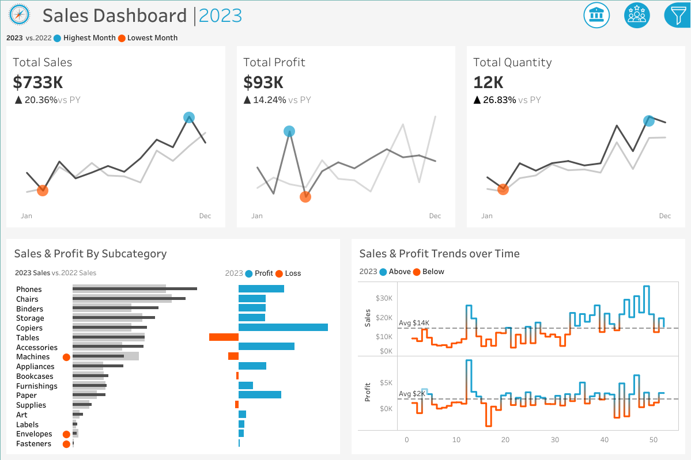

# 📊 Tableau Sales & Customer Dashboard

This project showcases an **interactive Tableau dashboard** built to analyze sales and customer performance. It demonstrates the complete workflow: **data preparation → visualization → business insights**.

---

## 🚀 Dashboard Link  
🔗 [View Live Dashboard on Tableau Public](https://public.tableau.com/views/SalesCustomerDashboard_17595119079390/SalesDashboard?:language=en-US&publish=yes&:sid=&:redirect=auth&:display_count=n&:origin=viz_share_link)

---

## 📂 Project Structure  

- **source/** → Raw and processed datasets  
- **tableau/** → Tableau workbook files (`.twb` / `.twbx`)  
- **output/** → Exported visuals (screenshots, PDFs)  
- **report/** → Documentation or project write-up  

---

## 📊 Features  

- Sales analysis by **region, product category, and customer segment**  
- Year-over-Year KPI tracking (revenue, profit, orders)  
- Customer behavior and segmentation insights  
- Interactive filters for drill-down exploration  

---

## 🛠 Tools Used  

- **Tableau** → Visualization & dashboard creation  
- **Excel/CSV** → Data source  
---

## 📷 Dashboard Preview  

  

---

## 📑 Key Insights  

- Regional performance highlights strengths and underperforming areas  
- Top product categories drive the majority of revenue  
- Customer segmentation enables more targeted strategies  
- KPIs help track business performance efficiently  

---

## Disclaimenr
This project is for educational and portfolio purposes. Data sources are public and may not reflect real company performance.

